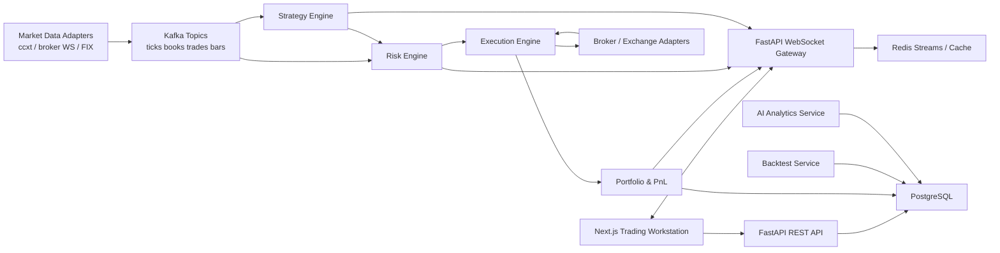

# Architecture

## Engineering Decisions

Aster uses a modular monorepo so shared domain language, API contracts, and deployment templates can evolve together while individual services remain independently deployable. The backend is Python-first because quant research, portfolio analytics, risk, and ML ecosystems are strongest there. The frontend is Next.js/React with a WebSocket-first data plane for terminal-grade responsiveness.

Critical path order flow:

1. Market data normalizes external feeds into canonical ticks, bars, books, and trades.
2. Strategy engine consumes canonical data and emits signed intents.
3. Risk engine validates every intent against portfolio, account, symbol, and session limits.
4. Execution engine transforms approved intents into order lifecycle events.
5. Portfolio service reconciles fills, positions, PnL, exposure, and risk analytics.
6. WebSocket gateway publishes terminal snapshots and incremental events.

## Service Diagram



## Repository Structure

```text
.
├── backend
│   ├── app
│   │   ├── api
│   │   ├── core
│   │   ├── domain
│   │   ├── services
│   │   └── main.py
│   ├── tests
│   └── pyproject.toml
├── frontend
│   ├── app
│   ├── components
│   ├── lib
│   ├── store
│   └── package.json
├── infra
│   ├── docker
│   ├── k8s
│   ├── monitoring
│   └── nginx
└── docs
```

## Database Schema

```sql
CREATE TABLE users (
    id UUID PRIMARY KEY,
    email TEXT UNIQUE NOT NULL,
    password_hash TEXT NOT NULL,
    role TEXT NOT NULL,
    mfa_enabled BOOLEAN NOT NULL DEFAULT false,
    created_at TIMESTAMPTZ NOT NULL DEFAULT now()
);

CREATE TABLE instruments (
    id UUID PRIMARY KEY,
    symbol TEXT UNIQUE NOT NULL,
    venue TEXT NOT NULL,
    asset_class TEXT NOT NULL,
    tick_size NUMERIC(18, 8) NOT NULL,
    lot_size NUMERIC(18, 8) NOT NULL,
    currency TEXT NOT NULL
);

CREATE TABLE orders (
    id UUID PRIMARY KEY,
    client_order_id TEXT UNIQUE NOT NULL,
    strategy_id TEXT NOT NULL,
    symbol TEXT NOT NULL,
    side TEXT NOT NULL,
    order_type TEXT NOT NULL,
    quantity NUMERIC(28, 10) NOT NULL,
    limit_price NUMERIC(28, 10),
    stop_price NUMERIC(28, 10),
    status TEXT NOT NULL,
    risk_status TEXT NOT NULL,
    created_at TIMESTAMPTZ NOT NULL DEFAULT now(),
    updated_at TIMESTAMPTZ NOT NULL DEFAULT now()
);

CREATE TABLE fills (
    id UUID PRIMARY KEY,
    order_id UUID REFERENCES orders(id),
    symbol TEXT NOT NULL,
    side TEXT NOT NULL,
    quantity NUMERIC(28, 10) NOT NULL,
    price NUMERIC(28, 10) NOT NULL,
    fees NUMERIC(28, 10) NOT NULL,
    liquidity TEXT NOT NULL,
    filled_at TIMESTAMPTZ NOT NULL
);

CREATE TABLE positions (
    id UUID PRIMARY KEY,
    account_id TEXT NOT NULL,
    symbol TEXT NOT NULL,
    quantity NUMERIC(28, 10) NOT NULL,
    avg_price NUMERIC(28, 10) NOT NULL,
    realized_pnl NUMERIC(28, 10) NOT NULL,
    updated_at TIMESTAMPTZ NOT NULL DEFAULT now(),
    UNIQUE(account_id, symbol)
);

CREATE TABLE risk_snapshots (
    id UUID PRIMARY KEY,
    account_id TEXT NOT NULL,
    gross_exposure NUMERIC(28, 10) NOT NULL,
    net_exposure NUMERIC(28, 10) NOT NULL,
    var_95 NUMERIC(28, 10) NOT NULL,
    max_drawdown NUMERIC(18, 8) NOT NULL,
    daily_pnl NUMERIC(28, 10) NOT NULL,
    kill_switch BOOLEAN NOT NULL,
    captured_at TIMESTAMPTZ NOT NULL DEFAULT now()
);

CREATE TABLE backtest_runs (
    id UUID PRIMARY KEY,
    strategy_id TEXT NOT NULL,
    config JSONB NOT NULL,
    metrics JSONB NOT NULL,
    equity_curve JSONB NOT NULL,
    created_at TIMESTAMPTZ NOT NULL DEFAULT now()
);
```

## API Design

All external APIs are versioned under `/api/v1`. Mutating trading endpoints require authenticated operator or service tokens, idempotency keys, and structured audit logging.

| Method | Path | Purpose |
| --- | --- | --- |
| `GET` | `/api/v1/health` | Service and dependency health. |
| `POST` | `/api/v1/auth/token` | Issue short-lived JWT for terminal/API clients. |
| `GET` | `/api/v1/market/snapshot` | Current quote, bars, book, trades, and watchlist state. |
| `POST` | `/api/v1/orders` | Submit risk-checked order intent. |
| `POST` | `/api/v1/orders/{id}/cancel` | Cancel active order. |
| `GET` | `/api/v1/portfolio` | Positions, PnL, allocations, exposures. |
| `GET` | `/api/v1/risk` | VaR, drawdown, limits, correlations, kill-switch status. |
| `POST` | `/api/v1/risk/kill-switch` | Enable or disable account-level trading halt. |
| `GET` | `/api/v1/strategies` | Installed strategies and live status. |
| `POST` | `/api/v1/backtests` | Run a deterministic backtest simulation. |
| `GET` | `/api/v1/analytics/assistant` | AI-assisted market and portfolio analysis. |
| `WS` | `/ws/terminal` | Realtime market, risk, portfolio, and execution stream. |

